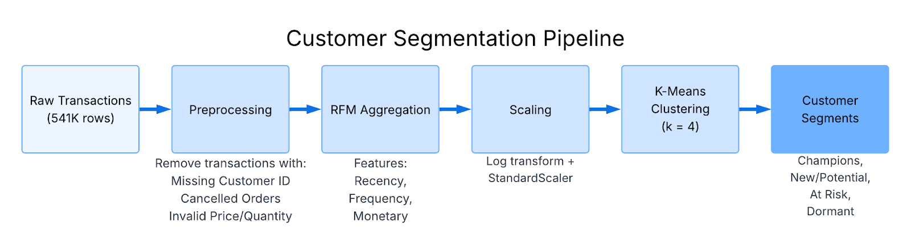

# Customer Segmentation Using K-Means Clustering

An analysis of e-commerce transaction data from the UCI Machine Learning Repository.

**Author:** Sayeem Mahfuz

## Background

Customer segmentation is a marketing analytics technique which divides a customer base into distinct groups which share similar characteristics. Efficient segmentation allows businesses to tailor their marketing strategies in order to optimize resource allocation and increase customer retention. This project uses K-means clustering on real e-commerce data to apply meaningful customer segmentation using RFM (Recency, Frequency, Monetary) analysis.

The chosen dataset [Online Retail](https://archive.ics.uci.edu/dataset/352/online+retail), from the UCI Machine Learning Repository contains 541,909 transactions from a UK-based online retail company which primarily sold "all-occasion gifts". The data spans from December 2010 to December 2011 and includes both direct consumers and wholesale customers.

Each transaction record contains:
- **InvoiceNo:** Unique 6-digit transaction identifier (cancelled transactions prefixed with 'C')
- **StockCode:** Product identifier
- **Description:** Product name
- **Quantity:** Number of units purchased
- **InvoiceDate:** Date and time of transaction
- **UnitPrice:** Price per unit in GBP (£)
- **CustomerID:** Unique customer identifier
- **Country:** Customer's country of residence

This dataset presents several real-world data quality challenges that make it ideal for demonstrating practical preprocessing skills, such as missing attributes like CustomerID, cancelled transactions which need to be filtered out, negative quantities representing returns, and invalid prices representing data entry errors.

## Methods

The methodology follows a five-step pipeline that transforms the raw data into interpretable and actionable customer segments.

### Step 1: Loading and Preprocessing the Data

The script loads from the CSV file which was originally downloaded from the UCI Machine Learning repository as .xlsx (Excel), and manually converted. Once loaded, three filtering operations are applied:

1. Transactions with missing CustomerID values are removed, because we need to differentiate unique customers for each purchase in order to analyse customer behaviour and properly apply segmentation.
2. Transactions with an InvoiceID beginning with 'C' are removed — the 'C' indicates cancelled orders.
3. Orders with negative or zero Quantity or UnitPrice values are removed. These typically indicate returns, adjustments, or data entry errors.

After cleaning, the script converts the InvoiceDate column to a proper datetime format and calculates a TotalPrice column by multiplying Quantity by UnitPrice for each transaction line.

### Step 2: RFM Feature Engineering

In this step, all orders are aggregated by unique customers (CustomerID) to compute the RFM metrics, since originally each customer's transactions were on multiple separate rows. A "snapshot date" is set as the day after the final transaction in the dataset. This serves as a reference date to calculate:

- **Recency:** The number of days between the snapshot date and each customer's most recent purchase
- **Frequency:** The number of unique transactions each customer had
- **Monetary:** The sum of all TotalPrice values for each customer

This produces a single row per customer with three numerical features describing their purchasing behavior.

### Step 3: Feature Scaling

The third step normalizes the RFM features for clustering. Monetary values might be in the thousands while Frequency values are typically single digits. Additionally, RFM distributions tend to be right-skewed, since there are many customers who spend modestly and a few who spend heavily — especially true because this dataset contains both retail and wholesale customers.

To address these issues:
1. **Log transformation** using the formula log(1 + x) compresses the range of large values and reduces skewness
2. **StandardScaler** centers each feature to have a mean of zero and scales it to have a standard deviation of one

This ensures all three RFM dimensions contribute equally to the clustering algorithm.

### Step 4: K-Means Clustering

The fourth step applies the K-Means algorithm with k = 4 clusters. This choice aligns with standard RFM segmentation practice, which typically identifies 4 key customer types based on purchasing behavior:

- **High value, active customers:** Low recency, high frequency/monetary values
- **At-risk customers:** High recency, but previously high frequency/monetary values
- **New or occasional customers:** Low recency, low frequency
- **Dormant/lost customers:** High recency, low frequency/monetary

### Step 5: Cluster Interpretation

The fifth step assigns meaningful labels to each cluster by examining average RFM values. The script calculates the median Recency, Frequency, and Monetary across all clusters, then classifies each cluster based on whether its values fall above or below these medians:

| Segment | Recency | Frequency | Monetary | Description |
|---------|---------|-----------|----------|-------------|
| **Champions** | Low | High | High | Best customers |
| **New/Potential** | Low | Low | Low | Recent customers who could be nurtured |
| **At Risk** | High | High | High | Previously active, showing disengagement |
| **Dormant** | High | Low | Low | Inactive or lost customers |

## Results

The preprocessing step reduced the dataset from 541,909 raw transactions to 397,884 clean records representing 4,338 unique customers. The removed records consisted primarily of:
- Records missing CustomerID (~135,000 records)
- Cancelled orders (~9,000 records)
- Invalid quantity or price values (~2,000 records)

The RFM feature engineering produced a dataset with notable variation across all three metrics:

| Metric | Range | Median | Notes |
|--------|-------|--------|-------|
| Recency | 1 – 374 days | ~50 days | Half purchased within 2 months; others inactive nearly a year |
| Frequency | 1 – 200+ transactions | 2 | Most are occasional buyers; small segment purchases frequently |
| Monetary | £3.75 – £280,000+ | £674.48 | Similar right-skewed distribution |

After applying K-Means clustering with k=4, the algorithm identified four distinct customer segments:

| Cluster | % of Customers | Avg Recency | Avg Frequency | Avg Monetary | Interpretation |
|---------|----------------|-------------|---------------|--------------|----------------|
| **Champions** | 16.5% | 12 days | 13 transactions | £8,074.27 | Most valuable customers |
| **New/Potential** | 19.3% | Low | Low | Low | Recently engaged, not yet regular |
| **At Risk** | 27.0% | High | Moderate-High | Moderate-High | Previously active, becoming disengaged |
| **Dormant** | 37.2% | 180 days | Low | Low | May already be lost |

  
  

The visualization clearly displays the customer segments in a two-dimensional scatter plot with Frequency on the x-axis and Monetary value on the y-axis, with points color-coded by cluster assignment. Champions are clustered in the upper-right region (high frequency, high spending), while the Dormant customers are clustered near the origin (low frequency, low spending).

## Conclusion

This analysis demonstrates that meaningful customer segmentation can be performed from transactional data using a simple pipeline with preprocessing, RFM feature engineering, scaling, and K-Means clustering.

The preprocessing step proved essential — roughly 27% of the raw data needed to be removed due to missing customer identifiers, cancelled transactions, or invalid price/quantity values. This speaks to the importance of data quality assessment before any analytical work, as attempting to cluster on the raw data would have produced misleading results.

The choice of k = 4 clusters, guided by RFM segmentation conventions, produced clearly interpretable segments with distinct behavioral profiles. Each segment could be actioned upon with different marketing strategies:

- **Champions:** Mark as VIPs with early access to new products or services
- **New/Potential:** Nurturing campaigns to encourage repurchases and build engagement
- **At Risk:** Proactive outreach before they become Dormant
- **Dormant:** Win-back offers, though resources may be better spent elsewhere

The feature scaling step also proved essential. Without log transformation and standardization, the Monetary dimension would have dominated the Euclidean distance calculations used for K-means clustering, effectively rendering the Recency and Frequency metrics useless.

A limitation of this analysis is the short and aged time range captured by the dataset. Access to more recent data covering a longer period would allow tracking how customers transition between segments over time, enabling early identification of customers moving toward At-Risk or Dormant segments.

## References

[1] UCI Machine Learning Repository. Online Retail Dataset. https://archive.ics.uci.edu/dataset/352/online+retail
